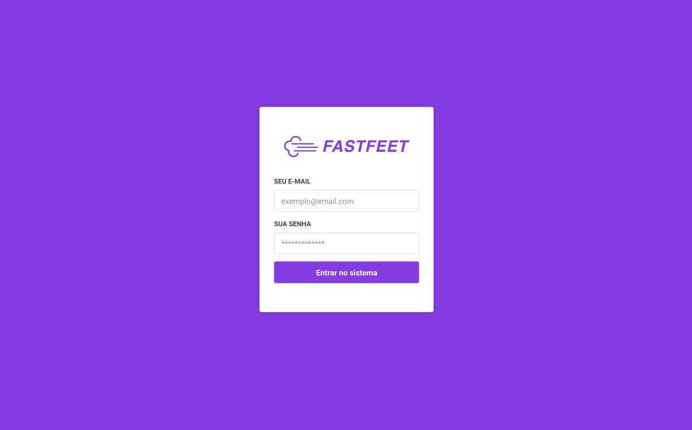
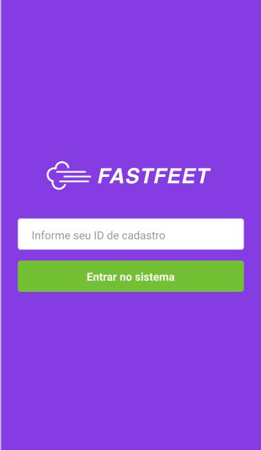

<h1 align="center">
  
</h1>

<h3 align="center">
  FastFeet
</h3>

## :rocket: FastFeet
> App para controle de transportadora, controlando produtos que saem para entrega, que são entregues com sucesso ou não, dos entregadores, etc.

### App para controle de Transportadora:

- Controle dos funcionarios/entregadores, cadastro, edição, delete.
- Cadastro de clientes, e destinatarios dos produtos.
- Controle de entregas, o que esta pendente agendar um Entregador para fazer o serviço.
- O que esta com o Entregador, pendente a entrega no cliente final.
- O que foi entregue, separado por entregador.
- O que foi cancelado, caso aconteça algum problema com a entrega, registrando o motivo da não entrega.
- O entregador ao finalizar a entrega, deve recolher a assinatura do cliente que recebeu no destino, e anexar a foto da assinatura no fechamento da entrega!
- Envio de e-mail para o entregador, sempre que uma encomenda for atribuida para que ele faça a entrega, ou quando a mesma for cancelada, por qualquer motivo.
- Espaço para o entregador uma observação de algum problema que teve na entrega, ou algum motivo que não permitiu realizar a entrega

>Tela Inicial da aplicação Web

</img>

>Tela login aplicação Mobile
 
</img>

>Dentro da pasta de cada aplicação, tem mais fotos!

## Criado por:

Fernando Santos – [@Fernando](https://www.linkedin.com/in/fernando-santos-686632122/) 
